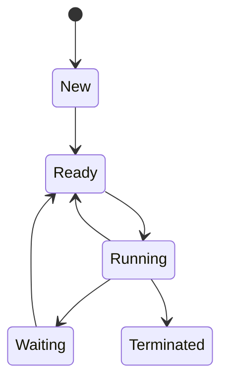

# 📘 Ringkasan Sistem Operasi

## 1. Instalasi Ubuntu Server

---

## 2. Layanan Sistem Operasi

### Eksekusi Program
- Memuat program ke memori dan menjalankannya.
- **Contoh:** Sistem operasi mengalokasikan CPU untuk menjalankan aplikasi seperti browser atau pengolah kata.

### Operasi I/O
- Menyediakan mekanisme terkendali untuk mengakses perangkat I/O.
- **Contoh:** Membaca data dari hard disk atau mengirim data ke printer.

### Manipulasi Sistem Berkas
- Membuat, menghapus, membaca, dan menulis file.
- **Contoh:** Membuka dokumen atau menyimpan file ke direktori.

### Komunikasi Antar Proses
- Memfasilitasi pertukaran data antar proses.
- **Contoh:** Sinkronisasi antara aplikasi klien dan server.

### Deteksi Kesalahan
- Mendeteksi error hardware atau kesalahan logika program.

### Proteksi
- Mengontrol akses pengguna ke sumber daya sistem.
- **Contoh:** Membatasi akses ke file sistem penting.

### Akuntansi
- Mencatat penggunaan sumber daya untuk audit.
- **Contoh:** Memonitor penggunaan CPU oleh setiap user.

---

## Diagram Status Proses

**Penjelasan Status:**
- **New:** Proses dibuat.
- **Ready:** Proses siap dijalankan.
- **Running:** Proses sedang dijalankan.
- **Waiting:** Proses menunggu event/sumber daya.
- **Terminated:** Proses selesai.

---

## 3. Usulan Sistem Operasi Server untuk Data Center

### Rekomendasi OS

#### Linux (RHEL, CentOS, Ubuntu Server)
- Open-source, hemat sumber daya.
- Mendukung Docker dan KVM.
- Cocok untuk aplikasi web dan database.

#### Windows Server
- GUI intuitif.
- Integrasi dengan Active Directory & SQL Server.
- Cocok untuk lingkungan enterprise.

### Aplikasi Penunjang

- **Virtualisasi/Kontainer:** VMware vSphere, Kubernetes
- **Load Balancer:** Nginx, HAProxy
- **Monitoring:** Prometheus + Grafana, Zabbix
- **Database:** MySQL, PostgreSQL, MongoDB
- **Backup:** Bacula
- **Keamanan:** SELinux, AppArmor, iptables, ufw

**📌 Saran:**  
Gunakan Linux untuk efisiensi dan fleksibilitas. Terapkan Kubernetes untuk orkestrasi kontainer dan Prometheus untuk monitoring otomatis.

---

## 4. Perbedaan Proses dan Thread

| Aspek        | Proses                                      | Thread                                 |
|--------------|---------------------------------------------|----------------------------------------|
| Definisi     | Instansi independen dari program.           | Unit eksekusi dalam proses.            |
| Sumber Daya  | Memiliki memori sendiri.                    | Berbagi memori dengan thread lain.     |
| Overhead     | Tinggi.                                     | Rendah.                                |
| Komunikasi   | Kompleks (IPC).                             | Mudah (memori bersama).                |
| Kegagalan    | Terisolasi.                                 | Dapat memengaruhi proses induk.        |

### ✅ Kelebihan Proses
- Isolasi baik, aman, stabil.

### ❌ Kekurangan Proses
- Konsumsi sumber daya tinggi.

### ✅ Kelebihan Thread
- Ringan, responsif.

### ❌ Kekurangan Thread
- Rentan terhadap deadlock & race condition.

---

## 5. Komponen Utama Sistem Operasi & Jenis Kernel

### Komponen Utama

- **Kernel:** Mengelola CPU, memori, dan perangkat keras.
- **Shell:** Antarmuka pengguna (CLI/GUI).
- **System Utilities:** Perintah dan alat bantu (contoh: `ls`, `ping`).

### Jenis Kernel

| Jenis         | Ciri Khas                                | Kelebihan            | Kekurangan                |
|---------------|-------------------------------------------|----------------------|---------------------------|
| Monolitik     | Semua layanan di kernel space.            | Performa tinggi      | Rentan crash sistem       |
| Mikrokernel    | Hanya layanan dasar di kernel space.      | Modular, stabil       | Overhead komunikasi       |
| Hybrid        | Gabungan keduanya.                        | Seimbang performa     | Kompleksitas tinggi       |

---

> 🔖 **Catatan:** File ini disusun sebagai ringkasan pembelajaran sistem operasi untuk keperluan kuliah atau dokumentasi teknis.
